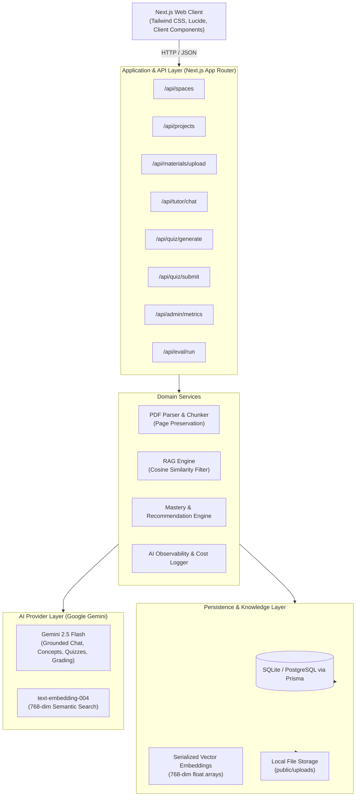

# AI Study Companion: System Architecture Documentation

## 1. High-Level Architecture Diagram

---

## 2. Core Architectural Principles

### 2.1 Project-Level Data Isolation
All materials, embeddings, conversation history, concept mastery, and quiz questions are strictly partitioned by `projectId`. RAG cosine similarity queries filter chunks exclusively belonging to the active project before ranking, guaranteeing zero cross-project leakage.

### 2.2 Evidence Over Guessing (Strict Grounding & Refusal)
When generating answers in the AI Tutor:
1. Candidate chunks are retrieved with cosine similarity ranking.
2. If similarity falls below the relevance threshold (or materials are absent), the system returns an explicit refusal:
   *"Based on the uploaded materials in this project, there is insufficient evidence to answer this question."*
3. Answers strictly generate verifiable citations in the format `[Document Name, Page X]`.

### 2.3 Closed-Loop Continuous Learning
The platform connects all experiences into a continuous loop:
$$\text{Materials Ingestion} \longrightarrow \text{Concept Extraction} \longrightarrow \text{Grounded Tutor} \longrightarrow \text{Adaptive Quiz} \longrightarrow \text{AI Evaluation} \longrightarrow \text{Mastery Update} \longrightarrow \text{Next Step Recommendation}$$

### 2.4 Observable AI
Every AI call logs:
- `latencyMs`: Round-trip execution time.
- `promptTokens` & `completionTokens`: Token consumption.
- `estimatedCost`: Calculated using live Gemini 2.5 Flash pricing.
- `success`: Status boolean and error traces.

---

## 3. Data Schema & Models

- **User**: Represents learners and administrators with role-based access.
- **Space**: High-level organizational subject area (e.g. Distributed Systems).
- **Project**: Focused workspace with specific learning goals.
- **Material**: Reference documents (PDFs) with processing status (`QUEUED`, `PROCESSING`, `EXTRACTING`, `READY`, `FAILED`).
- **MaterialChunk**: Text segments with exact `pageNumber` and 768-dim embedding arrays.
- **Concept**: Core ideas extracted from materials with `masteryScore` (0–100%) and status (`NEEDS_ATTENTION`, `STABLE`, `MASTERED`).
- **Conversation & ChatMessage**: Multi-turn grounded dialogue with JSON-serialized citations.
- **Quiz & QuizQuestion**: Diagnostic tests supporting both Multiple Choice Questions and Open-Ended questions.
- **QuizAttempt**: Stores student answers, AI grading feedback, and score deltas.
- **Recommendation**: Dynamic 1-sentence next learning actions based on the lowest mastery concept.
- **AiLog**: Audit log for AI telemetry, token counts, and cost tracking.
